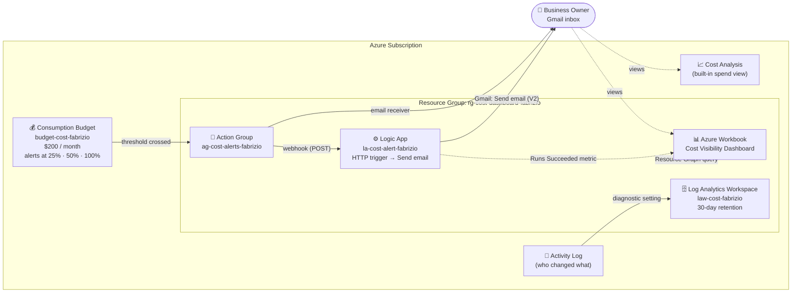
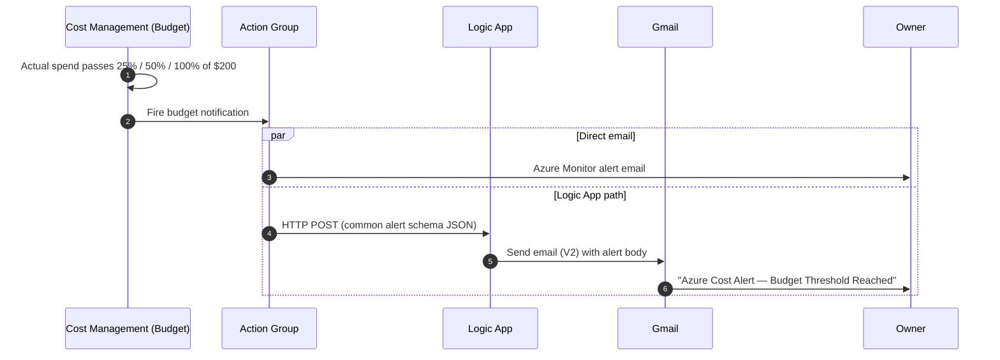
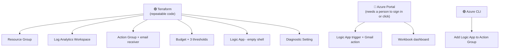
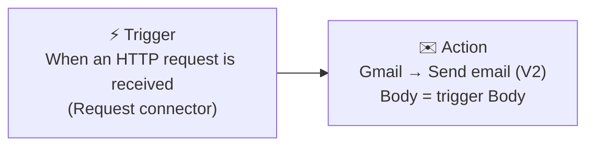
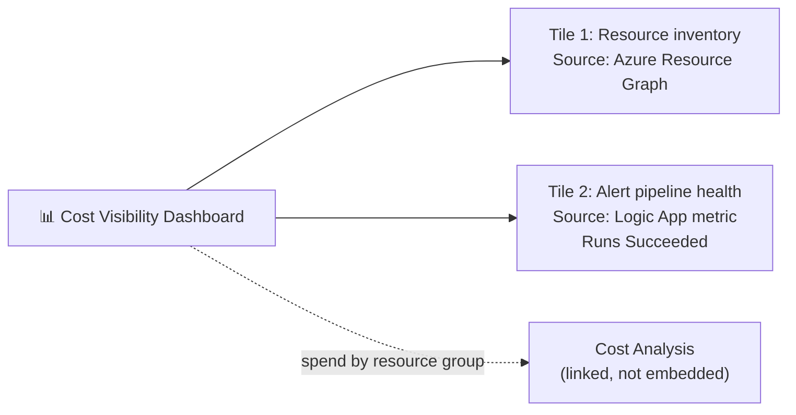

# Azure Cost Visibility Dashboard

**Status:** ✅ Deployed with Terraform and tested end to end (budget → Action Group → Logic App → Gmail).

> 🎬 **Video walkthrough:** _add link_

---

## 📖 Overview

Many small businesses move to the cloud because they're told it will cost less than running their own servers. Then the monthly invoice shows up packed with entries like `Microsoft.Compute/virtualMachines — $340`, and no one on the team can say what it is, whether it's normal, or what next month will look like.

This project solves that problem. It's a cost monitoring and alerting system that lets a business owner see what they're spending on Azure, warns them automatically before costs get out of hand, and presents the numbers in a way a non-engineer can follow.

**What the system does:**

- **Watches spend** against a monthly $200 subscription budget and raises an alert at **$50, $100, and $200** (25%, 50%, and 100%)
- **Sends an email** through a Logic App (Azure's low-code automation service) to Gmail the moment a threshold is crossed
- **Shows a dashboard** in Azure Workbooks with a live list of every resource group in the subscription, plus a health metric proving the alert pipeline itself is working
- **Relies on Azure's built-in Cost Analysis view** for the detailed dollars-by-resource-group breakdown, because Workbooks can't pull Cost Management data directly (explained in [Step 10](#step-10--build-the-workbook-dashboard))

**Business outcome:** the owner hears about rising costs *before* the bill arrives, and can see at a glance what is actually running in their subscription. The Azure services are how it's built, not the point.

### Skills demonstrated

- **IaC (Infrastructure as Code)** with Terraform and the `azurerm` provider
- **Azure Cost Management** – subscription-level budget, three alert thresholds, Cost Analysis for spend breakdowns
- **Azure Monitor** – Action Groups, diagnostic settings, platform metrics
- **Log Analytics** – central collection of the subscription activity log
- **Logic Apps** – event-driven workflow (HTTP trigger → Gmail action) fired by monitoring alerts
- **Azure Workbooks** – dashboard combining Azure Resource Graph queries with Azure Monitor metrics
- **Azure CLI (Command-Line Interface)** – updating Action Groups from the terminal, handling zsh quoting on macOS
- **Troubleshooting** – Terraform resource ID format, shell parsing errors, email connector limits, configuration drift

---

## 🏗️ Architecture

### How the pieces connect



### What happens when a threshold is crossed



### Who builds what: Terraform vs. portal vs. CLI



---

## 🏷️ Naming conventions

`[yourname]` = `fabrizio` throughout.

| Resource | Pattern | My value |
|---|---|---|
| Resource Group | `rg-cost-dashboard-[yourname]` | `rg-cost-dashboard-fabrizio` |
| Log Analytics Workspace | `law-cost-[yourname]` | `law-cost-fabrizio` |
| Action Group | `ag-cost-alerts-[yourname]` | `ag-cost-alerts-fabrizio` |
| Action Group short name | max 12 characters | `costalerts` |
| Budget | `budget-cost-[yourname]` | `budget-cost-fabrizio` |
| Logic App | `la-cost-alert-[yourname]` | `la-cost-alert-fabrizio` |
| Diagnostic Setting | fixed | `diag-sub-to-law` |
| Logic App receiver (in Action Group) | fixed | `la-webhook` |
| Gmail connection | fixed | `conn-gmail-cost-alerts` |
| Workbook | fixed | `Cost Visibility Dashboard` |

---

## ✅ Prerequisites (macOS)

Skip what you already have.

```bash
# 1. Homebrew (Mac package manager)
/bin/bash -c "$(curl -fsSL https://raw.githubusercontent.com/Homebrew/install/HEAD/install.sh)"

# 2. Terraform
brew tap hashicorp/tap
brew install hashicorp/tap/terraform
terraform --version

# 3. Azure CLI
brew install azure-cli
az --version

# 4. Log in and pick your subscription
az login
az account set --subscription "Azure subscription 1"
az account show
```

You also need:
- A Gmail account (for the Logic App email step)
- Permission to create budgets. If you get `AuthorizationFailed`, see [Troubleshooting](#️-troubleshooting).

---

## 🪜 Build steps

### Step 1 — Create the project folder

```bash
cd "$HOME/Cloud Engineering Labs"
mkdir Azure-cost-visibility-dashboard
cd Azure-cost-visibility-dashboard
touch main.tf variables.tf outputs.tf terraform.tfvars
```

> 💡 The parent folder name has spaces, so it must be in quotes. Without quotes the shell reads it as 3 separate words (`cd: too many arguments`).

Resulting layout:

```text
Azure-cost-visibility-dashboard/
├── main.tf            # the resources
├── variables.tf       # input declarations (the blank form)
├── terraform.tfvars   # my values (the filled-in form) – keep out of Git
└── outputs.tf         # values printed after deploy
```

---

### Step 2 — `variables.tf` (declare the inputs)

```hcl
variable "yourname" {
  description = "Lowercase name, no spaces. Makes resource names unique."
  type        = string
}

variable "location" {
  description = "Azure region."
  type        = string
  default     = "East US"
}

variable "alert_email" {
  description = "Where cost alerts are sent."
  type        = string
}

variable "tags" {
  description = "Labels added to every resource."
  type        = map(string)
  default = {
    project     = "cost-dashboard"
    environment = "dev"
    managed_by  = "terraform"
  }
}
```

---

### Step 3 — `terraform.tfvars` (fill in the values)

```hcl
yourname    = "fabrizio"
location    = "East US"
alert_email = "you@example.com"
```

`variables.tf` says **what inputs exist**. `terraform.tfvars` says **what their values are**. Terraform loads `terraform.tfvars` automatically.

Add it to `.gitignore` so your email doesn't end up on GitHub:

```bash
echo "terraform.tfvars" >> .gitignore
echo ".terraform/" >> .gitignore
echo "*.tfstate*" >> .gitignore
```

---

### Step 4 — `main.tf` (the resources)

#### 4.1 Provider and current login info

The provider is the plugin Terraform uses to talk to Azure. The `azurerm_client_config` data source reads your `az login` session to get your subscription ID.

```hcl
terraform {
  required_providers {
    azurerm = {
      source  = "hashicorp/azurerm"
      version = "~> 3.0"
    }
  }
}

provider "azurerm" {
  features {}
}

data "azurerm_client_config" "current" {}
```

#### 4.2 Resource group

A folder for everything in this project. Delete it and everything inside goes with it.

```hcl
resource "azurerm_resource_group" "main" {
  name     = "rg-cost-dashboard-${var.yourname}"
  location = var.location
  tags     = var.tags
}
```

#### 4.3 Log Analytics workspace

Central storage for logs you can search. `PerGB2018` = pay only for data you send in. 30 days is the shortest retention, which keeps cost near zero.

```hcl
resource "azurerm_log_analytics_workspace" "main" {
  name                = "law-cost-${var.yourname}"
  location            = var.location
  resource_group_name = azurerm_resource_group.main.name
  sku                 = "PerGB2018"
  retention_in_days   = 30
  tags                = var.tags
}
```

#### 4.4 Action Group

The "who to notify" list. Defined once, reused by all 3 budget thresholds.

```hcl
resource "azurerm_monitor_action_group" "email_alerts" {
  name                = "ag-cost-alerts-${var.yourname}"
  resource_group_name = azurerm_resource_group.main.name
  short_name          = "costalerts" # max 12 characters

  email_receiver {
    name                    = "owner-email"
    email_address           = var.alert_email
    use_common_alert_schema = true # same alert format for every alert type
  }

  tags = var.tags
}
```

#### 4.5 Budget with 3 thresholds

Watches actual spend for the whole subscription and resets every month.

| Threshold | % of $200 | Fires at |
|---|---|---|
| 1 | 25% | $50 |
| 2 | 50% | $100 |
| 3 | 100% | $200 |

```hcl
resource "azurerm_consumption_budget_subscription" "main" {
  name = "budget-cost-${var.yourname}"

  # Needs the FULL path "/subscriptions/<id>", not just the ID.
  subscription_id = "/subscriptions/${data.azurerm_client_config.current.subscription_id}"

  amount     = 200
  time_grain = "Monthly"

  time_period {
    # First day of the CURRENT month, in RFC3339 format (YYYY-MM-DDTHH:MM:SSZ, Z = UTC)
    start_date = "2026-09-01T00:00:00Z"
  }

  notification {
    enabled        = true
    threshold      = 25
    operator       = "GreaterThan"
    threshold_type = "Actual"
    contact_groups = [azurerm_monitor_action_group.email_alerts.id]
  }

  notification {
    enabled        = true
    threshold      = 50
    operator       = "GreaterThan"
    threshold_type = "Actual"
    contact_groups = [azurerm_monitor_action_group.email_alerts.id]
  }

  notification {
    enabled        = true
    threshold      = 100
    operator       = "GreaterThan"
    threshold_type = "Actual"
    contact_groups = [azurerm_monitor_action_group.email_alerts.id]
  }
}
```

> ⚠️ **Date trap:** Azure checks the month in **UTC**. On the last day of a month, US Eastern time rolls into the next UTC month at 8 PM. If you deploy after that, use the first of the next month.

#### 4.6 Logic App (empty shell)

Terraform creates the container only. The trigger and email steps are built in the portal (Step 7) because the Gmail sign-in must be done by a person.

```hcl
resource "azurerm_logic_app_workflow" "cost_alert" {
  name                = "la-cost-alert-${var.yourname}"
  location            = var.location
  resource_group_name = azurerm_resource_group.main.name
  tags                = var.tags
}
```

#### 4.7 Send the subscription activity log to Log Analytics

The activity log records every management action (create, delete, change) on the subscription. This setting copies it into the workspace so it can be searched.

```hcl
resource "azurerm_monitor_diagnostic_setting" "subscription_logs" {
  name                       = "diag-sub-to-law"
  target_resource_id         = "/subscriptions/${data.azurerm_client_config.current.subscription_id}"
  log_analytics_workspace_id = azurerm_log_analytics_workspace.main.id

  enabled_log { category = "Administrative" }
  enabled_log { category = "Security" }
  enabled_log { category = "Policy" }
}
```

---

### Step 5 — `outputs.tf`

```hcl
output "resource_group_name" {
  value = azurerm_resource_group.main.name
}

output "log_analytics_workspace_id" {
  value = azurerm_log_analytics_workspace.main.id
}

output "logic_app_access_endpoint" {
  description = "Base endpoint of the workflow. NOT the full trigger URL – copy that from the designer after saving."
  value       = azurerm_logic_app_workflow.cost_alert.access_endpoint
}

output "action_group_id" {
  value = azurerm_monitor_action_group.email_alerts.id
}
```

> 💡 `access_endpoint` is only the base address. The real trigger URL has an extra path and a secret signature (`sig=`), and it only exists after the trigger is saved in Step 7.

---

### Step 6 — Deploy

```bash
terraform init      # downloads the azurerm provider
terraform fmt       # auto-formats the .tf files
terraform validate  # checks syntax
terraform plan      # preview: expect 6 to add
terraform apply     # type "yes"; takes ~2–3 minutes
```

Expected plan: **6 to add** → resource group, workspace, action group, budget, Logic App, diagnostic setting.

> 📧 Right after apply, Azure emails you that you were added to the Action Group. That's expected.

---

### Step 7 — Build the Logic App workflow (portal)



1. Portal → **Resource groups** → `rg-cost-dashboard-fabrizio` → `la-cost-alert-fabrizio`
2. Left menu → **Development Tools** → **Logic app designer**
3. **Add a trigger** → search **Request** → select **When a HTTP request is received**
   - ⚠️ Not the "HTTP" connector. Those triggers make the Logic App *call out*. You need one that *waits to be called*.
4. Leave the JSON (JavaScript Object Notation) schema empty. Set **Method** to **POST**.
5. Click **Save**. Click the trigger again and copy the **HTTP URL** (it only appears after saving). Keep it private.
6. Click **+** under the trigger → **Add an action** → search **Gmail** → **Send email (V2)**
7. Create the connection:
   - **Connection name:** `conn-gmail-cost-alerts`
   - **Authentication type:** `Use default shared application`
   - **Sign in** with Google and allow access
8. Fill in the fields:
   - **To:** your alert email
   - **Subject:** `Azure Cost Alert – Budget Threshold Reached`
   - **Body:** click in the box → click the ⚡ **lightning icon** (dynamic content) → under the trigger pick **Body**
9. Click **Save**.

> **Why Gmail and not Office 365 Outlook?** The Office 365 connector needs a work or school Microsoft 365 mailbox. This lab runs on a personal account, so Gmail is the working choice. In a company already on Microsoft 365, Office 365 Outlook is the natural default. The designer steps are the same.


---

### Step 8 — Connect the Logic App to the Action Group (CLI)

Get your subscription ID:

```bash
SUB_ID=$(az account show --query id -o tsv)
```

Add the Logic App as a receiver. **Put the URL in single quotes**:

```bash
az monitor action-group update \
  --name ag-cost-alerts-fabrizio \
  --resource-group rg-cost-dashboard-fabrizio \
  --add-action logicapp la-webhook \
    "/subscriptions/$SUB_ID/resourceGroups/rg-cost-dashboard-fabrizio/providers/Microsoft.Logic/workflows/la-cost-alert-fabrizio" \
    '<PASTE-FULL-TRIGGER-URL-HERE>' \
    usecommonalertschema
```

Argument order for `--add-action logicapp`:

| Position | Value | Meaning |
|---|---|---|
| 1 | `la-webhook` | Name of this receiver |
| 2 | `/subscriptions/.../la-cost-alert-fabrizio` | Logic App resource ID |
| 3 | `'https://...sig=...'` | Trigger callback URL |
| 4 | `usecommonalertschema` | Send the standard alert format |

Verify:

```bash
az monitor action-group show \
  -n ag-cost-alerts-fabrizio \
  -g rg-cost-dashboard-fabrizio \
  --query logicAppReceivers
```

Expected: one entry named `la-webhook` with `"useCommonAlertSchema": true`.

<details>
<summary><b>Portal alternative</b> (use this on Windows)</summary>

On Windows, `az` is a batch script (`az.cmd`) that re-reads arguments through `cmd.exe`, which treats `&` as a command separator even inside PowerShell quotes. Use the portal instead:

1. **Monitor** → **Alerts** → **Action groups** → `ag-cost-alerts-fabrizio`
2. **Edit** → **Actions** tab → Action type **Logic App**
3. Select subscription → resource group → `la-cost-alert-fabrizio` → trigger is auto-detected
4. Enable common alert schema: **Yes**. Identity: **None** (the URL signature secures the call)
5. Name: `la-webhook` → **Save**
</details>

---

### Step 9 — Test the alert pipeline

Don't wait for real spend.

1. **Monitor** → **Alerts** → **Action groups** → `ag-cost-alerts-fabrizio`
2. **Test action group** → sample type **Budget** → **Test**
3. Check:
   - ✅ Gmail: **2 emails** (one from Azure Monitor, one from the Logic App)
   - ✅ Logic App → **Run history**: a run marked **Succeeded**

---

### Step 10 — Build the Workbook dashboard

A Workbook is a dashboard page inside the portal.



**Tile 1 — resource group inventory**

1. **Monitor** → **Workbooks** → **+ New**
2. **+ Add** → **Add query**
3. **Data source:** `Azure Resource Graph`
4. **Subscriptions:** select your subscription (the query won't run without a scope)
5. Paste and **Run Query**:

```kusto
resourcecontainers
| where type == "microsoft.resources/subscriptions/resourcegroups"
| project resourceGroup, location
| order by resourceGroup asc
```

6. **Done Editing**

**Tile 2 — alert pipeline health**

1. **+ Add** → **Add metric**
2. Resource type: **Logic App workflow** → resource: `la-cost-alert-fabrizio`
3. Metric: **Runs Succeeded** · Aggregation: **Count**
4. **Done Editing**

**Save:** 💾 → name `Cost Visibility Dashboard` → resource group `rg-cost-dashboard-fabrizio` → **Apply**

> 💡 **Why not show dollars in the Workbook?** The "Add metric" control only lists resources that send Azure Monitor metrics. Cost Management doesn't, so it isn't an option. The right tool for dollars is **Cost Analysis**:
> **Cost Management** → **Cost analysis** → **Group by: Resource group** → save the view.

---

## ☑️ Verification checklist

- [ ] `rg-cost-dashboard-fabrizio` exists
- [ ] `budget-cost-fabrizio` shows in **Cost Management → Budgets** with 3 alert conditions
- [ ] `ag-cost-alerts-fabrizio` has an **email** receiver and a **Logic App** receiver
- [ ] `la-cost-alert-fabrizio` is **Enabled** and shows trigger + Gmail action
- [ ] Test action group → 2 emails received, Logic App run **Succeeded**
- [ ] `law-cost-fabrizio` exists and receives activity log data
- [ ] `Cost Visibility Dashboard` is saved in **Monitor → Workbooks**

---

## 🛠️ Troubleshooting

| Error / symptom | Cause | Fix |
|---|---|---|
| `cd: too many arguments` | Folder path has spaces | Quote it: `cd "$HOME/Cloud Engineering Labs"` |
| `cd: no such file or directory: /Azure-...` | A leading `/` means "start from the top of the drive" | Drop the `/` for a folder inside the current one: `cd Azure-cost-visibility-dashboard` |
| `parsing the Subscription ID: the number of segments didn't match` | The budget wants `/subscriptions/<id>`; the data source returns only `<id>` | `subscription_id = "/subscriptions/${data.azurerm_client_config.current.subscription_id}"` |
| `BudgetStartDateInvalid` | Start date is not the 1st of the current or a future month (checked in UTC) | Set `start_date` to the 1st of the current month |
| `AuthorizationFailed` on the budget | Missing Cost Management permissions | `az role assignment create --role "Cost Management Contributor" --assignee <email> --scope /subscriptions/<sub-id>` |
| Trigger list shows only "HTTP", "HTTP + Swagger", "HTTP Webhook" | Those are outbound triggers | Search **Request** → **When a HTTP request is received** |
| HTTP URL says "URL will be generated after save" | URL is created on save | Click **Save**, then reopen the trigger |
| Office 365 Outlook connector fails to sign in | Needs a work/school Microsoft 365 mailbox | Use **Gmail** or **Outlook.com** connector |
| `zsh: parse error near '&'` | `&` in the URL means "run in background" to the shell | Wrap the URL in **single quotes** |
| Action group update fails with extra argument | Lab doc put the Logic App name between receiver name and resource ID | Format: `logicapp <name> <resource-id> '<url>' usecommonalertschema` |
| No budget alert email | Budgets only fire on real spend crossing a threshold | Use **Test action group** (Step 9) |

---

## ⚠️ Known gaps and next improvements

1. **Config drift.** Step 8 adds the Logic App receiver outside Terraform. The next `terraform apply` may remove it to match the code.
   *Fix:* manage the trigger in Terraform with `azurerm_logic_app_trigger_http_request`, then add a `logic_app_receiver` block to the Action Group using its `callback_url`.
2. **Secret in the URL.** The `sig=` value in the trigger URL works like a password. Never commit or screenshot it. Rotate it via Logic App → **Settings → Access keys → Regenerate**.
3. **Raw JSON emails.** The Logic App forwards the alert body as-is. Next step: add a **Parse JSON** action and write a plain-English email ("You've spent $52 of your $200 budget").
4. **Forecast alerts.** Add `threshold_type = "Forecasted"` notifications to warn *before* spend happens, not after.
5. **State storage.** Terraform state is local. For team use, store it in an Azure Storage backend.

---

## 🧹 Cleanup

```bash
terraform destroy   # type "yes"
```

Also remove what Terraform didn't create:
- **Workbook** (if saved outside the resource group)
- **Gmail API connection** (`conn-gmail-cost-alerts`) – deleted with the resource group if it lives there; otherwise remove it from **API connections**

Confirm nothing is left:

```bash
az group show -n rg-cost-dashboard-fabrizio   # expect: ResourceGroupNotFound
az consumption budget list --query "[].name"  # budget-cost-fabrizio should be gone
```

---

## 💡 Key takeaways

- **Split the work by tool strength.** Terraform for anything repeatable. The portal for steps that need a human sign-in (Gmail OAuth, the secure web sign-in standard).
- **One Action Group, many alerts.** Notification targets live in one place instead of being copied into each threshold.
- **Read error messages literally.** "Number of segments didn't match" pointed straight at the missing `/subscriptions/` prefix.
- **Know your shell.** `&`, spaces, and quotes cause most CLI failures. Single quotes stop zsh from touching special characters.
- **Use the right tool for the view.** Workbooks for inventory and health; Cost Analysis for dollars.
- **The deliverable is clarity, not resources.** A business owner gets warned before the bill is a surprise.

---

**Author:** Fabrizio Mastrogiovanni · **Project:** Azure Cost Visibility Dashboard
